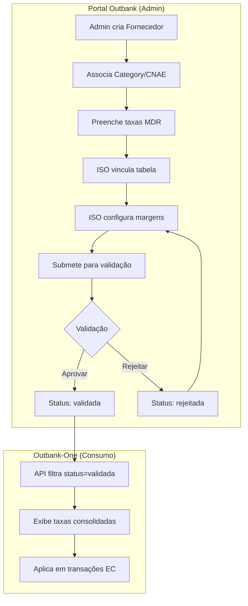
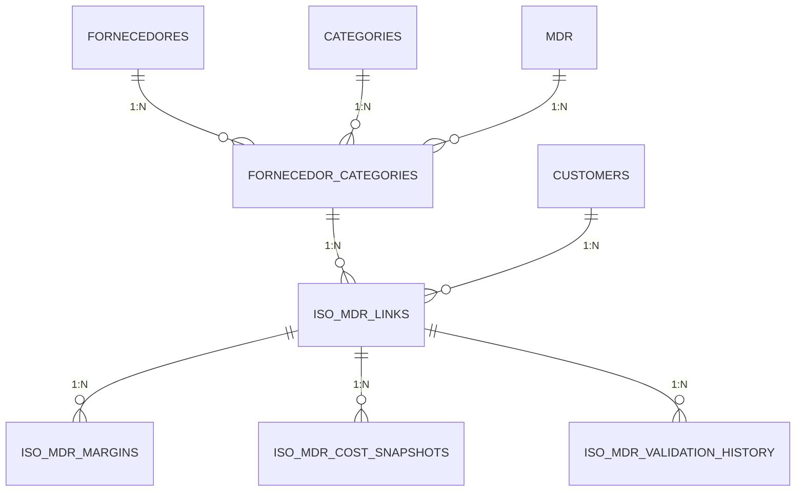
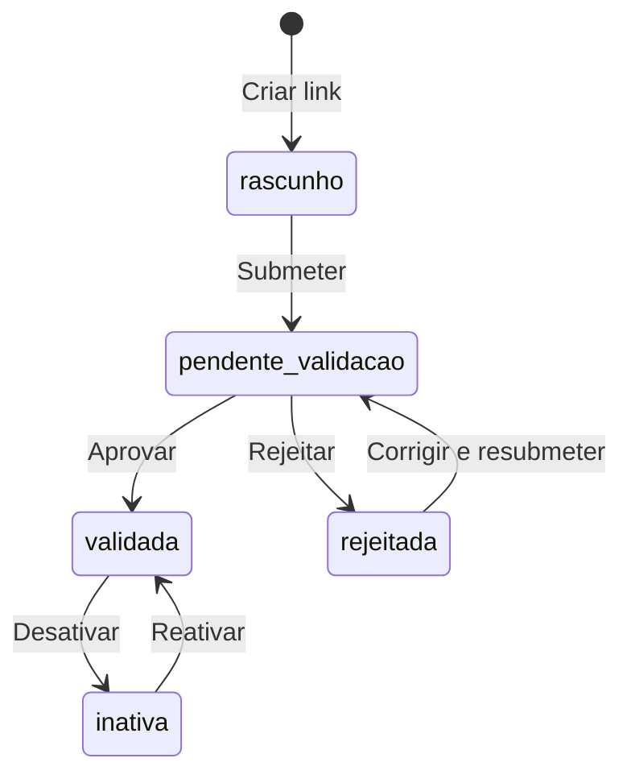

# Fluxo de Tabelas MDR: Portal-Outbank → Outbank-One

Este documento descreve o fluxo completo desde a criação de uma tabela MDR no **portal-outbank** até sua validação e consumo pelo **outbank-one**.

---

## 📊 Visão Geral da Arquitetura



---

## 🗄️ Estrutura do Banco de Dados

### Tabelas Principais

| Tabela | Descrição | Repositório |
|--------|-----------|-------------|
| `mdr` | Taxas base por modalidade (débito, crédito, PIX, etc.) | Ambos |
| `fornecedores` | Fornecedores de adquirência | Ambos |
| `fornecedor_categories` | Associação Fornecedor ↔ Category (CNAE) + MDR | Ambos |
| `iso_mdr_links` | Vínculo ISO ↔ Tabela MDR (com status de validação) | Ambos |
| `iso_mdr_margins` | Margens do ISO por bandeira/modalidade | Ambos |
| `iso_mdr_cost_snapshots` | Snapshots de custo consolidado | Ambos |
| `iso_mdr_validation_history` | Histórico de alterações de status | Ambos |
| `categories` | Categorias (MCC, CNAE) | Ambos |

### Relacionamentos



---

## 🔄 Fluxo Detalhado

### 1. Criação da Tabela MDR (Portal-Outbank)

**Arquivos principais:**
- [MdrRepository](file:///Users/denisonzimmerdaluz/Documents/GitHub/portal-outbank/src/lib/db/mdr.ts) - CRUD de MDR
- [MdrForm](file:///Users/denisonzimmerdaluz/Documents/GitHub/portal-outbank/src/components/supplier/MdrForm.tsx) - UI de preenchimento

**Processo:**
1. Admin cadastra um **Fornecedor** (ex: Adquirente XYZ)
2. Associa uma **Category** (CNAE/MCC) ao fornecedor → cria registro em `fornecedor_categories`
3. Preenche as taxas MDR para cada modalidade:
   - **POS**: débito, crédito, crédito 2x, crédito 7x, voucher, PRE, antecipação
   - **Online**: mesmas modalidades
   - **PIX**: custo e margem por canal
4. Dados salvos na tabela `mdr` e vinculados via `fornecedor_categories.mdr_id`

### 2. Vínculo ISO-MDR (Portal-Outbank)

**Arquivos principais:**
- [IsoMarginsRepository](file:///Users/denisonzimmerdaluz/Documents/GitHub/portal-outbank/src/lib/db/iso-margins.ts) - Lógica de vínculo
- [IsoMdrForm](file:///Users/denisonzimmerdaluz/Documents/GitHub/portal-outbank/src/components/iso/IsoMdrForm.tsx) - UI de margens do ISO

**Processo:**
1. ISO (customer) seleciona tabelas MDR disponíveis
2. Função `linkMdrTable()` cria registro em `iso_mdr_links`:
   ```sql
   INSERT INTO iso_mdr_links (customer_id, fornecedor_category_id, is_active, status)
   VALUES ($1, $2, true, 'rascunho')
   ```
3. ISO configura suas **margens** por bandeira/modalidade
4. Margens salvas em `iso_mdr_margins`:
   ```sql
   INSERT INTO iso_mdr_margins (iso_mdr_link_id, bandeira, modalidade, margin_iso)
   VALUES ($1, $2, $3, $4)
   ```

### 3. Workflow de Validação (Portal-Outbank)

**Arquivos principais:**
- [MdrValidationModal](file:///Users/denisonzimmerdaluz/Documents/GitHub/portal-outbank/src/components/supplier/MdrValidationModal.tsx) - Modal de validação
- [validate/route.ts](file:///Users/denisonzimmerdaluz/Documents/GitHub/portal-outbank/src/app/api/margens/iso/[customerId]/validate/route.ts) - API de validação

**Estados possíveis:**

| Status | Descrição |
|--------|-----------|
| `rascunho` | Tabela em edição, não disponível para consumo |
| `pendente_validacao` | ISO submeteu para aprovação |
| `validada` | ✅ Aprovada, disponível para consumo |
| `rejeitada` | ❌ Rejeitada com motivo, pode ser corrigida |
| `inativa` | Desativada manualmente |

**Fluxo de estados:**



**API de mudança de status:**
```typescript
// POST /api/supplier/{fornecedorId}/cnae/{categoryId}/validation
{
  action: 'approve' | 'reject' | 'submit' | 'deactivate' | 'reactivate',
  reason?: string // obrigatório para reject
}
```

### 4. Consumo pelo Outbank-One

**Arquivos principais:**
- [mdr-db.ts](file:///Users/denisonzimmerdaluz/Documents/GitHub/outbank-one/src/features/mdr/server/mdr-db.ts) - Funções de consulta
- [tabelas-mdr/route.ts](file:///Users/denisonzimmerdaluz/Documents/GitHub/outbank-one/src/app/api/tenant/tabelas-mdr/route.ts) - API principal

**Critério de consumo:**
> Apenas tabelas com `status = 'validada'` são retornadas

**Query de consumo:**
```typescript
const links = await db
  .select({...})
  .from(isoMdrLinks)
  .innerJoin(fornecedorCategories, eq(isoMdrLinks.fornecedorCategoryId, fornecedorCategories.id))
  .innerJoin(mdr, eq(fornecedorCategories.mdrId, mdr.id))
  .leftJoin(categories, eq(fornecedorCategories.categoryId, categories.id))
  .where(
    and(
      eq(isoMdrLinks.customerId, customerId),
      eq(isoMdrLinks.status, "validada")  // ← FILTRO CRÍTICO
    )
  );
```

**Resposta da API:**
```typescript
interface TabelaMdrResponse {
  linkId: string;
  mdrId: string;
  categoryName: string | null;
  mcc: string | null;
  cnae: string | null;
  bandeiras: string | null;
  status: string | null;
  custoConsolidado: {
    pos: { debito, credito, credito_2x, credito_7x, voucher, pix, antecipacao };
    online: { debito, credito, credito_2x, credito_7x, voucher, pix, antecipacao };
  };
  margemIso: {
    pos: { [bandeira: string]: { [modalidade: string]: string } };
    online: { [bandeira: string]: { [modalidade: string]: string } };
  };
}
```

---

## 📁 Mapeamento de Arquivos

### Portal-Outbank

| Caminho | Função |
|---------|--------|
| `src/lib/db/mdr.ts` | CRUD de taxas MDR |
| `src/lib/db/mdr-versioning.ts` | Versionamento e notificações |
| `src/lib/db/iso-margins.ts` | Vínculo ISO-MDR e margens |
| `src/components/supplier/MdrForm.tsx` | Formulário de taxas |
| `src/components/supplier/MdrValidationModal.tsx` | Modal de validação |
| `src/components/iso/IsoMdrForm.tsx` | Formulário de margens ISO |
| `src/app/api/tenant/tabelas-mdr/route.ts` | API de tabelas do tenant |

### Outbank-One

| Caminho | Função |
|---------|--------|
| `src/features/mdr/server/mdr-db.ts` | Funções de consulta |
| `src/features/mdr/_components/` | Componentes de UI |
| `src/app/api/tenant/tabelas-mdr/route.ts` | API de consumo |
| `src/drizzle/schema.ts` | Definição das tabelas |

---

## 🔐 Pontos Críticos para Implementação

### 1. Validação Obrigatória
> ⚠️ Tabelas só são consumidas se `status = 'validada'`

### 2. Tenant Isolation
Ambas APIs verificam o `customerId` via cookie/sessão para garantir isolamento multi-tenant.

### 3. Cálculo de Taxa Final
```
Taxa Final = Custo Base (MDR) + Margem ISO
```
O cálculo é feito em tempo de consulta, consolidando dados de `mdr` + `iso_mdr_margins`.

### 4. Snapshots de Custo
A tabela `iso_mdr_cost_snapshots` armazena snapshots pré-calculados para evitar recálculos frequentes.

---

## ✅ Checklist de Validação

Para uma tabela MDR ser consumida pelo outbank-one:

- [ ] Fornecedor criado e ativo
- [ ] Category associada ao fornecedor
- [ ] Taxas MDR preenchidas na tabela `mdr`
- [ ] `fornecedor_categories.mdr_id` apontando para a tabela MDR
- [ ] ISO vinculou a tabela (`iso_mdr_links` criado)
- [ ] Margens do ISO configuradas (opcional, default 0)
- [ ] Status do link = `validada`
