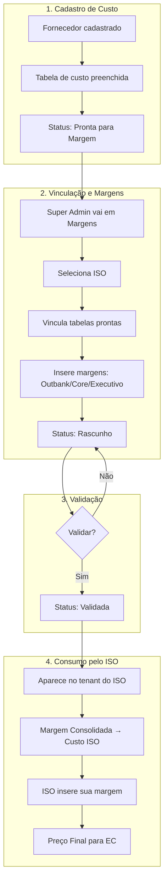

# Fluxo de Tabelas MDR: Documentação Completa

## Visão Geral do Ciclo de Vida



---

## Tipos de Tabelas

| Tipo | Descrição | Onde aparece |
|------|-----------|--------------|
| **Tabela de Custo** | Custo do fornecedor (Dock, etc.) | Portal > Fornecedores |
| **Tabela Vinculada (Rascunho)** | Vinculada a um ISO, com margens em edição | Portal > Margens |
| **Tabela Validada** | Aprovada, disponível para o ISO | Portal > Margens + Tenant ISO |

---

## Fluxo Detalhado

### 1. Cadastro de Custo (Fornecedor)

- Admin cadastra fornecedor e sua tabela de custo
- Custo representa o preço cobrado pelo fornecedor (Dock, etc.)
- Quando completa, fica "pronta para margem"

### 2. Vinculação ao ISO

SuperAdmin ou usuário autorizado:
1. Acessa página **Margens**
2. Seleciona o **ISO** desejado
3. **Vincula** as tabelas prontas
4. Insere **margens por usuário**:
   - **Outbank** (obrigatório)
   - **Core** (opcional)
   - **Executivo** (opcional)

> ⚠️ Margens são em % e alteram cada modalidade (crédito, débito, PIX, etc.)

### 3. Estados da Tabela Vinculada

| Estado | Descrição |
|--------|-----------|
| `rascunho` | Em edição, não aparece para o ISO |
| `pendente_validacao` | Submetida para aprovação |
| `validada` | ✅ Aparece no tenant do ISO |
| `rejeitada` | Devolvida com motivo |
| `inativa` | Desativada manualmente |

### 4. Consumo pelo ISO (Tenant)

Após validação:
- Tabela aparece em **Taxas MDR** do ambiente tenant
- **Margem Consolidada** (Outbank + Core + Executivo) vira o **Custo do ISO**
- ISO insere **sua margem** adicional
- **Preço Final** = Custo ISO + Margem ISO → usado pelo EC

---

## Regras Críticas de Negócio

### ⚠️ Isolamento por ISO
```
Cada tabela vinculada possui REGISTRO PRÓPRIO por ISO.
Alterações em uma tabela NÃO afetam outros ISOs.
```

### ⚠️ Proteção Contratual
```
Tabelas validadas NÃO sofrem alterações automáticas.
Isso evita problemas jurídicos com contratos vigentes.
```

### ⚠️ Versionamento
```
ISO pode duplicar tabelas e ter várias versões.
Cada versão mantém independência de preços.
```

---

## Cálculo de Preços

```
├── Custo Fornecedor (Dock)         = X%
│
├── + Margem Outbank               = Y%
├── + Margem Core (opcional)       = Z%
├── + Margem Executivo (opcional)  = W%
│
├── = MARGEM CONSOLIDADA           = X + Y + Z + W
│     (Custo do ISO)
│
├── + Margem ISO                   = I%
│
└── = PREÇO FINAL PARA EC          = Consolidada + I
```

---

## Estrutura de Banco

| Tabela | Função |
|--------|--------|
| `mdr` | Custos base do fornecedor |
| `fornecedor_categories` | Liga Fornecedor + Category + MDR |
| `iso_mdr_links` | **Vínculo único por ISO** (status, datas) |
| `iso_mdr_margins` | Margens do ISO sobre custo consolidado |
| `iso_mdr_cost_snapshots` | Custos pré-calculados (performance) |
| `iso_mdr_validation_history` | Histórico de mudanças de status |

---

## Pontos-Chave

1. **Margem Outbank é obrigatória** - outras são opcionais
2. **Cada ISO tem seu registro** - sem interferência entre ISOs
3. **Tabelas não mudam automaticamente** - proteção jurídica
4. **ISO pode duplicar** - múltiplas versões permitidas
5. **Validação libera para tenant** - só validadas aparecem
